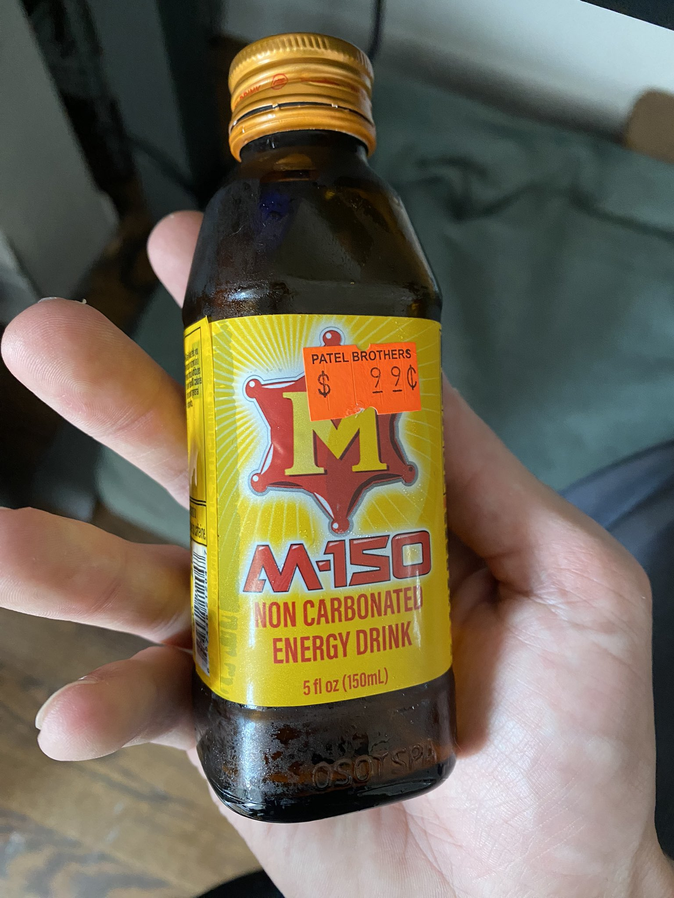
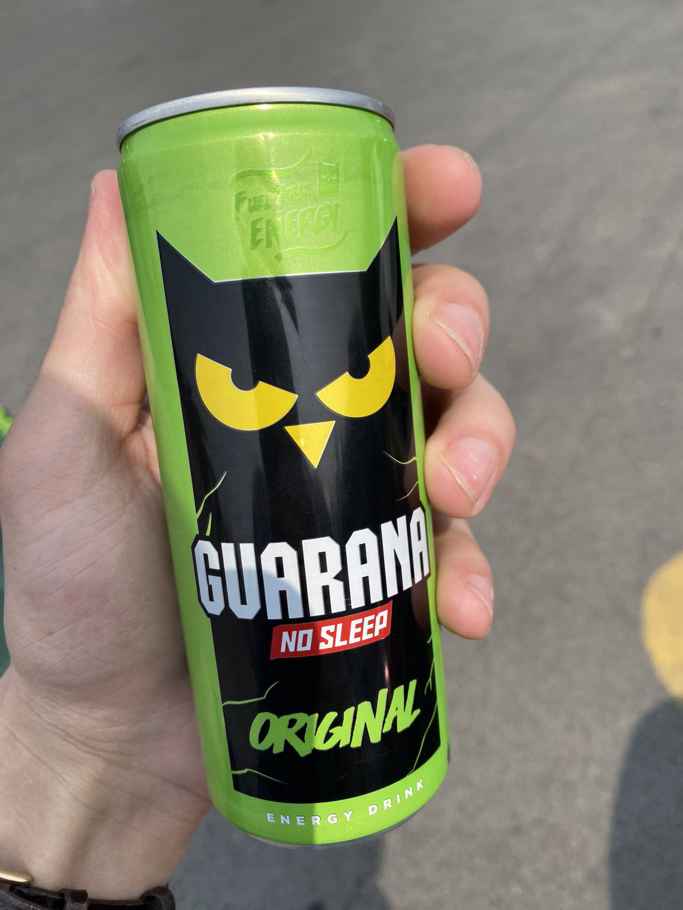
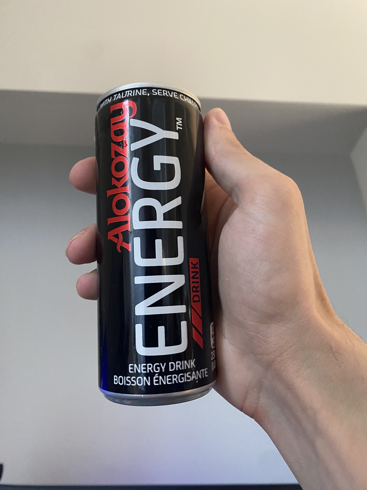
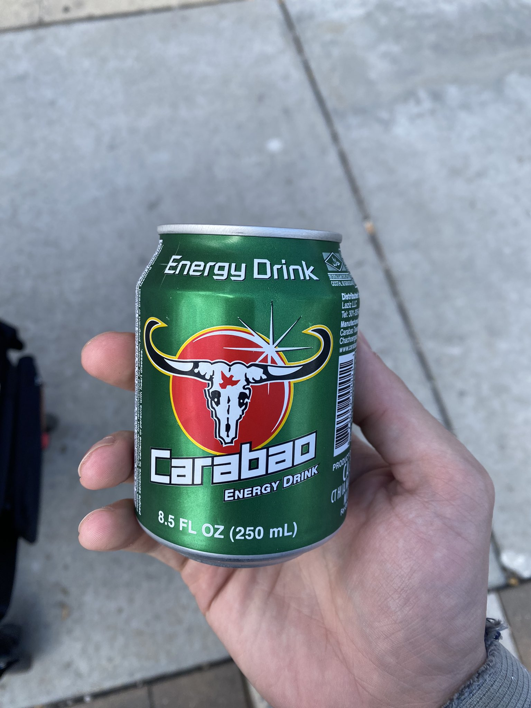

M150 Can - 5/10 - sugar rush in a can, tastes good but has the caffeine of a cup of tea
M150 Bottle - 6/10 - same as the can, i just like glass bottles more

Guarana Original - 7/10 tastes like sour apple masking chemicals

Alokozay Energy - 4/10 tastes like chemicals

Ginseng Energy - 8/10 i dont know if this had caffeine, but it tasted pretty good. I would drink this. Tasted like pear juice.

Carabao - 5/10 - Sugar rush in a can, I think its the exact same stuff as the M150 in a different can.
