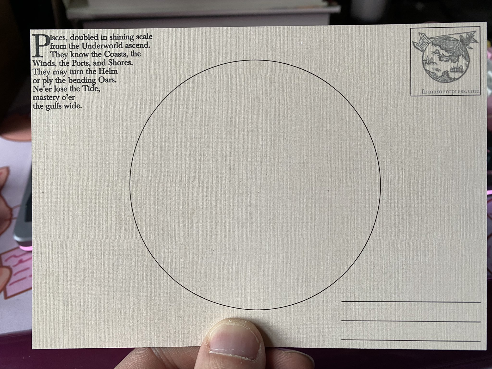
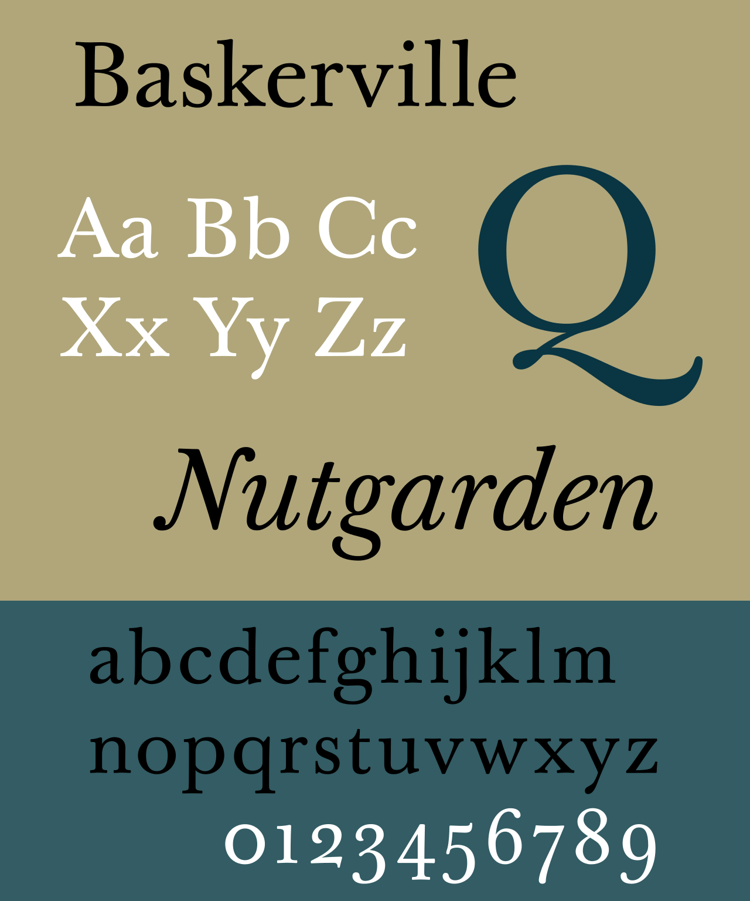

I am collector and sender of postcards and this was a small project undertaken to create a series of 12 postcards, each themed off the traditional zodiac symbols. The intention is to provide a canvas to showcase Dr. John Bevis's [Uranographia Britannica (ca. 1749)](https://publicdomainreview.org/collection/bevis-uranographia) on the front side (I'm a huge fan of the public domain!).

To this end, I drafted a series of 12 small poems. You can see in the image above the desired format - it was an interesting challenge to work within the constraints of the form. You can find them (here)[[writing.creative.astro-poems]]. I leaned heavily on Marcus Manilius's Astronomica, as translated by Thomas Creech (1659-1700) - as well as referring to a fair amount of anglo poetry from the early modern era. Also, a lot of old assyriologists/egyptologists from the late 19th/early 20th century. I have the full list of references on a hard drive somewhere, I hope to get around to recovering them one day.

Baskerville was an intuitive choice of typeface, being a product of the era I intended to emulate. I'm sure others exist, but Baskerville is popular and readily available for use.

These would be a useful tool for anyone interested in chart-drawing. There is enough space to briefly elucidate the chart, but the space for the chart itself is not too small so as to be cramped. I was not satisfied with the finish on the first batch and one day will revisit.
